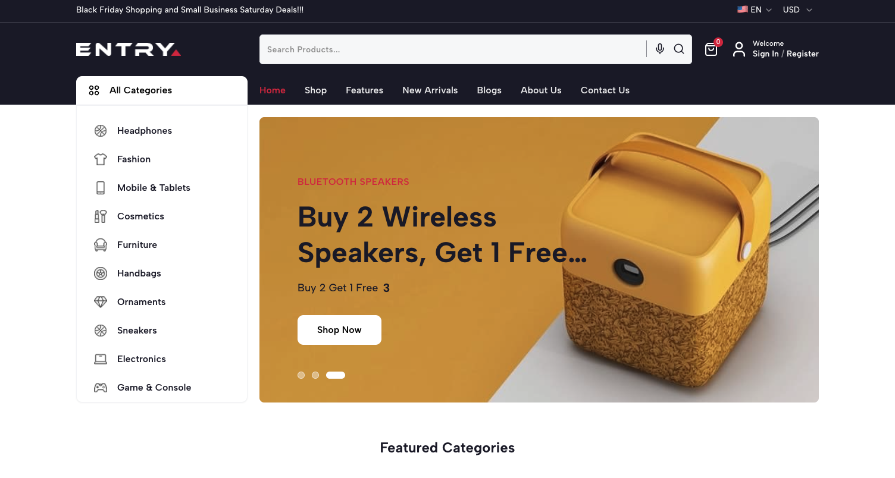

# Entry E-commerce Platform Monorepo

Welcome to the **Entry E-commerce Platform** – a robust, production-ready full-stack e-commerce solution built with modern technologies. Whether you are aiming to launch a complete store setup or learn enterprise-grade architecture using Turborepo, this repository has everything you need.



## 💎 Get the Premium Code

Unlock the full potential of this repository by getting the premium code! The premium version includes advanced features, prioritized support, and complete setup instructions.

🔗 **[Click here to get the Premium Code & Setup Guide](https://buymeacoffee.com/reactbd/e/518205)**

## 🚀 Key Features

### 🛍️ Customer Storefront (Next.js)

- **High Performance**: Built with Next.js 16+ (App Router) to ensure lightning-fast render speeds and SEO dominance.
- **Beautiful & Modern UI**: Tailored with Tailwind CSS and Shadcn UI components for an engaging shopping experience.
- **Responsive Design**: Flawlessly adapts across mobile, tablet, and desktop devices screens.
- **SEO Optimized**: Advanced Meta tags, OpenGraph support, structured JSON-LD data.

### ⚡ Power Admin Dashboard (Vite + React)

- **Product Management**: Intuitive interface to create, edit, classify and manage complete inventory.
- **Order Processing**: Real-time status tracking, bulk processing, invoice generation, and shipment management.
- **Comprehensive Analytics**: Dashboard visualizations of sales metrics, revenue, and customer behaviors.

### 🔒 Secure Backend (Node.js/Express)

- **Role-Based Access Control**: Fully secured JWT authentication paths separating Customers from Admins.
- **Scalable Architecture**: Flexible and heavily optimized MongoDB schemas tailored exclusively for modern storefront needs.
- **Payment & Security**: Pre-integrated with providers like Stripe, handling seamless transactions.

## 🛠️ Tech Stack & Tooling

| Ecosystem        | Technologies                                                  |
| ---------------- | ------------------------------------------------------------- |
| **Monorepo**     | Turborepo, pnpm                                               |
| **Frontend**     | Next.js 16+, React 19, Tailwind CSS, Shadcn UI, Framer Motion |
| **Admin**        | Vite, React 19, Recharts, Tailwind CSS                        |
| **Backend**      | Node.js, Express, Mongoose                                    |
| **Database**     | MongoDB (Atlas / Local)                                       |
| **Integrations** | Stripe, Firebase Auth, Cloudinary                             |

## 🧱 Project Structure

This project uses a highly efficient [Turborepo](https://turbo.build/) monorepo structure.

```txt
entry-ecommerce/
├── apps/
│   ├── web/          # Next.js 16+ Customer Storefront
│   ├── admin/        # Vite + React Admin Dashboard
│   └── api/          # Express Backend API Server
├── packages/
│   ├── types/        # Shared TypeScript Interfaces & Types
│   ├── ui/           # Shared UI Component Library (Shadcn + Tailwind)
│   └── config/       # Shared Constants, Prettier, ESLint configurations
├── docs/             # Documentation & Setup Guides
├── scripts/          # Helper tools and Database Migration scripts
```

## 📚 Getting Started

To get the platform running locally, navigate through our tailored guides to streamline your setup process:

### 1. [Installation & Local Setup](docs/SETUP.md) 👈 START HERE

Begin here. Learn how to install project dependencies via `pnpm`, configure `.env` variables across all apps, and properly start the Turborepo development servers (`pnpm dev`).

### 2. [Database Setup & Data Import](docs/DATABASE_SETUP.md)

Discover how to connect to your MongoDB Atlas cluster or local database instance and seed the initial dataset (demo products, users, categories) so your layout is populated right away.

### 3. [Basic Architecture & Skills Overview](docs/BASICS.md)

A high-level primer on the application's flow, covering exactly how the standard data fetch works natively on the `web` side and where mutations are routed to `api`.

### 4. [Deployment & Production Setup](docs/PRODUCTION_READY.md)

Read our checklist and procedures for safely deploying the Next.js `web` app, Vite `admin` dashboard, and Express `api` securely to production environments (Vercel, Render, AWS, etc.).

## 🔐 Environment Setup

Each application module (`apps/web`, `apps/admin`, `apps/api`) has its own `.env.example` file.

You must copy these into local `.env` files for execution. For example:

- `apps/api/.env` needs MongoDB URIs, JWT Secrets, Stripe Secret Keys.
- `apps/web/.env` needs API endpoint URLs and Public Stripe Keys.
- Reference `docs/SETUP.md` for a master list of required keys.

## 🤝 Contributing & Customization

We welcome contributions and open discussions! If you need help tailoring the product for custom needs, extending the API routes, or have bug reports, please feel free to open an Issue or pull request.

---

**Created with ❤️ by the Entry Team & ReactBD**
